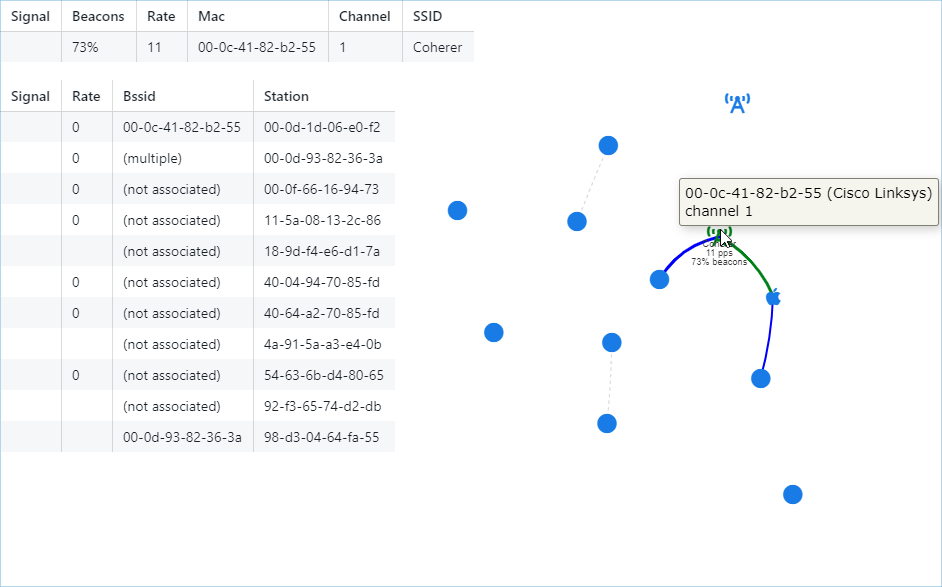

# wifi-visualizer

## Running samples

```
cargo run --release -- --file caps/wpa-Induction.pcap
```



```
cargo run --release -- --no-sleep-playback --file caps/Network_Join_Nokia_Mobile.pcap
```

```
gzip -c -d caps/wpa-eap-tls.pcap.gz | cargo run --release -- --file -
```

## Usage

```
USAGE:
    wifi-visualizer.exe [FLAGS] --file <FILE> --interface <INTERFACE>

FLAGS:
    -v, --debug                Show debug messages, multiple flags for higher verbosity
    -h, --help                 Prints help information
    -n, --no-browser           Don't open browser
        --no-sleep-playback    Don't play back files at original speed
    -V, --version              Prints version information

OPTIONS:
    -f, --file <FILE>              File to read from
    -i, --interface <INTERFACE>    Interface to capture packets from
```

## Local

```sh
wifi-visualizer --interface wlan0mon
```

## Remote SSH

```sh
ssh root@router "tcpdump -U --immediate-mode -i mon0 -w -" | wifi-visualizer --file -
```

## Remote Wireshark

```bat
REM need to set PATH so dlls link correctly
set PATH=C:\Program Files\Wireshark

"C:\Program Files\Wireshark\extcap\sshdump.exe" --capture --extcap-interface sshdump --remote-host router --remote-port 22 --sshkey id_rsa --remote-username root --remote-interface mon0 --fifo - | wifi-visualizer --file -
```

## Changing channels

```sh
iw dev mon0 set channel %1
```

# Resources

Sample captures from https://wiki.wireshark.org/SampleCaptures#Wifi_.2F_Wireless_LAN_captures_.2F_802.11
